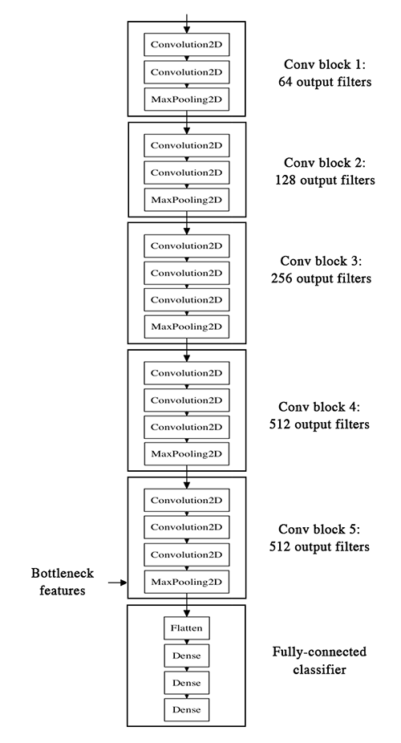

# CatDog

In this project, I attempt to build a Machine Learning model to differentiate cat images from dog images.
For this task, the dataset I have used is a subset provided by kaggle, of MSR's dataset of over 3 Million images.

I am using the features learned by the VGG16 Net by Visual Geometry Group, Oxford.

## (Preprocessing) `scripts/split.py`
Split the data into train and test sets (80-20 %).
## `extract_features.py`
Feed test and train images to (all but last block of) VGG16 net and compute outputs.
## `train_output_layers.py`
Retrain the fully connected layers using extracted features. 
## `finetune.py`
Finetune/Retrain the second last block of VGG16 net for better accuracy. (90 % on validation set)

## `filtervis.py`
"How does a ConvNet see a cat/dog ?"
Visualizes some Convolutional filters from the retrained model.
## Setup

### Data
Download the train data from [here](https://www.kaggle.com/c/dogs-vs-cats/data) and 
unzip the images to `raw` directory in `data` directory. 
### Pretrained model
Download the VGG16 Net weights [here](https://drive.google.com/file/d/0Bz7KyqmuGsilT0J5dmRCM0ROVHc/view?usp=sharing)
and save the file in `models` directory as `vgg16_weights.h5`.

### Split
Run `scripts/split.py` to split the data into train and test sets.